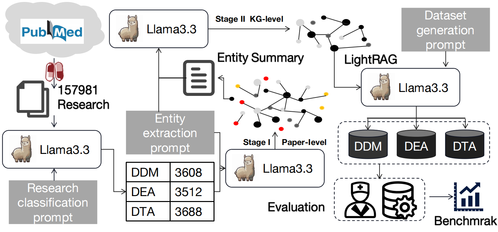

# $\text{Uni}D^3$: LLM-driven Drug-Disease Dataset Construction via KG-RAG


### Overview
With the rapid development of large language models (LLMs) in the biomedical field, building high-quality and scalable drug-disease datasets (D3) still faces the dual challenges of high annotation costs and data scarcity. To this end, this paper proposes UniD3, a generative dataset based on knowledge graph retrieval augmented generation (KG-RAG). UniD3 includes three tasks: Drug-Disease Matching (DDM), Drug Effectiveness Assessment (DEA), and Drug-Target Analysis (DTA). We collected more than 150K papers on drugs from PubMed, combined with carefully designed prompts to guide LLM to extract relation triplets; and a dual-stage knowledge graph construction strategy was introduced to reduce noise information and optimize knowledge graph construction. Finally, the generated samples were evaluated and verified using external datasets (F1 score is higher than 0.8 in all three tasks) and clinic experts (F1 reaches 0.9005 on the DDM). This framework not only greatly reduces labor costs, but also has good scalability, and the dataset can be updated while iteratively updating the KG. The genertared KGs and vector database are stored in [zenodo](https://zenodo.org/records/15368180).




### UniD3 QA （under [LightRAG](https://github.com/HKUDS/LightRAG) framework）
   ```bash
   # Please download the generated knowledge graph from zenodo before using UniD3 QA. 
   # Please specify the specific working path, large language model and RAG mode.
   $ python QA_launcher.py --working_dir "/UniD3/KG_building_level2/level2_T2_70B" --model "myllama3.3_70B" --mode "mix"
   ```


### Dataset Usage  
   (1) [DDM](https://huggingface.co/datasets/Mike2481/UniD3_DDM)
   
   #### Pandas  
   ```
   import pandas as pd
   # Login using e.g. `huggingface-cli login` to access this dataset
   df = pd.read_csv("hf://datasets/Mike2481/UniD3_DDM/DDM.csv")
   ```
   #### HuggingFace 
   ```
   from datasets import load_dataset
   # Login using e.g. `huggingface-cli login` to access this dataset
   ds = load_dataset("Mike2481/UniD3_DDM")
   ```

   (2) [DEA](https://huggingface.co/datasets/Mike2481/UniD3_DEA)

   #### Pandas  
   ```
   import pandas as pd
   # Login using e.g. `huggingface-cli login` to access this dataset
   df = pd.read_csv("hf://datasets/Mike2481/UniD3_DEA/DEA.csv")
   ```
   #### HuggingFace 
   ```
   from datasets import load_dataset
   # Login using e.g. `huggingface-cli login` to access this dataset
   ds = load_dataset("Mike2481/UniD3_DEA")
   ```
   
   (3) [DTA](https://huggingface.co/datasets/Mike2481/UniD3_DTA)

   #### Pandas  
   ```
   import pandas as pd
   # Login using e.g. `huggingface-cli login` to access this dataset
   df = pd.read_csv("hf://datasets/Mike2481/UniD3_DTA/DTA.csv")
   ```
   #### HuggingFace 
   ```
   from datasets import load_dataset
   # Login using e.g. `huggingface-cli login` to access this dataset
   ds = load_dataset("Mike2481/UniD3_DTA")
   ```
### Citation

### License
MIT License © Qianqian Song Lab
