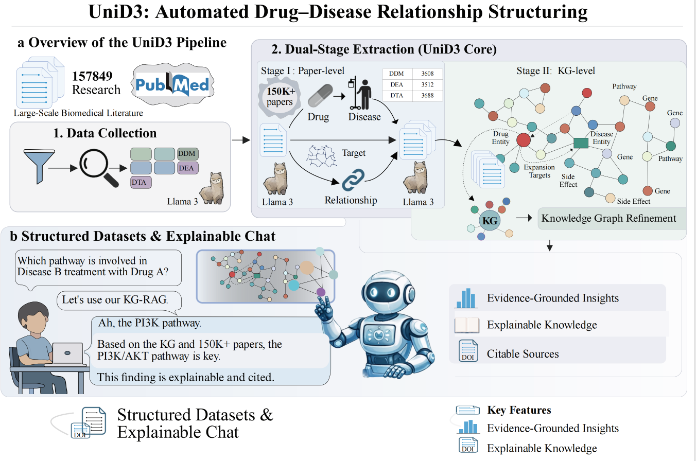

# $\text{Uni}D^3$: Open Knowledge Graphs and QA Benchmarks for Drug–Disease Discovery and Reasoning

[](https://arxiv.org/abs/2606.01394)
[](https://unid3.site/)
[](https://zenodo.org/records/15368180)
[](https://huggingface.co/datasets/Mike2481/UniD3_DDM)
[](https://huggingface.co/datasets/Mike2481/UniD3_DEA)
[](https://huggingface.co/datasets/Mike2481/UniD3_DTA)

📄 **Paper:** [UniD³: A knowledge graph-enhanced RAG framework for drug-disease discovery and reasoning](https://arxiv.org/abs/2606.01394) (arXiv:2606.01394)

💬 **Web Chatbot:** [https://unid3.site/](https://unid3.site/)

📦 **Knowledge graphs & vector database (Zenodo):** [https://zenodo.org/records/15368180](https://zenodo.org/records/15368180)

### Overview

Drug--disease knowledge underpins drug discovery and precision medicine, yet most of it is locked in unstructured PubMed articles and only partially captured by curated databases. We release UniD3
-KG, a suite of six knowledge graphs spanning three tasks (Drug--Disease Matching, DDM; Drug Effectiveness Assessment, DEA; and Drug--Target Analysis, DTA), and UniD3
-data, three open QA datasets (
 DDM, 
 DEA and 
 DTA pairs), distilled from 
 PubMed articles with Llama-3.3-70B by the UniD3
 KG-RAG pipeline, which couples task-specific prompting with a dual-stage entity extraction that re-extracts over the consolidated graph to recover cross-chunk and cross-document evidence. External validation on CDR, DrugReviews, P3ps and MedicationQA and a benchmark across seven LLM baselines and three retrieval variants show that UniD3
-data is faithful to curated sources and that retrieval over UniD3
-KG consistently improves biomedical QA; a blinded clinician review of 
 FDA-approved, US-marketed drugs further confirms strong agreement with the UniD3
-data DDM split (accuracy 
, F1 
, AUROC 
). All artefacts---UniD3
-KG, UniD3
-data, benchmark scripts and the UniD3
-QA explainable chatbot---are released as shared infrastructure for biomedical NLP and drug repurposing. The interactive UniD3 web chatbot is now live at [https://unid3.site/](https://unid3.site/), and the generated KGs and vector database are available on Zenodo at [https://zenodo.org/records/15368180](https://zenodo.org/records/15368180).




### UniD3 QA （under [LightRAG](https://github.com/HKUDS/LightRAG) framework（required lightrag-hku==1.1.0））
   ```bash
   # Please download the generated knowledge graph and vector database from Zenodo (https://zenodo.org/records/15368180) before using UniD3 QA. 
   # Please specify the specific working path, large language model and RAG mode.
   $ conda env create -f UniD3_environment.yaml
   # run ollama before here
   $ python QA_launcher.py --working_dir "/UniD3/KG_building_level2/level2_T2_70B" --model "myllama3.3_70B" --mode "mix"
   ```


### Dataset Usage

The three QA datasets (DDM, DEA, DTA) are publicly available on the Hugging Face Hub:

| Task | Dataset | Link |
| --- | --- | --- |
| Drug–Disease Matching (DDM) | `Mike2481/UniD3_DDM` | https://huggingface.co/datasets/Mike2481/UniD3_DDM |
| Drug Effectiveness Assessment (DEA) | `Mike2481/UniD3_DEA` | https://huggingface.co/datasets/Mike2481/UniD3_DEA |
| Drug–Target Analysis (DTA) | `Mike2481/UniD3_DTA` | https://huggingface.co/datasets/Mike2481/UniD3_DTA |

Load them directly with the 🤗 `datasets` library:

```python
from datasets import load_dataset

ddm = load_dataset("Mike2481/UniD3_DDM")
dea = load_dataset("Mike2481/UniD3_DEA")
dta = load_dataset("Mike2481/UniD3_DTA")
```

### Resources

| Resource | Link |
| --- | --- |
| Paper (arXiv) | https://arxiv.org/abs/2606.01394 |
| Web chatbot | https://unid3.site/ |
| Knowledge graphs & vector database (Zenodo) | https://zenodo.org/records/15368180 |
| Dataset — DDM | https://huggingface.co/datasets/Mike2481/UniD3_DDM |
| Dataset — DEA | https://huggingface.co/datasets/Mike2481/UniD3_DEA |
| Dataset — DTA | https://huggingface.co/datasets/Mike2481/UniD3_DTA |

### Citation

If you find this project is useful for your research, please cite:
```
Wang Q, Liu T, Zhou M, Liang J, Guo S, Wang G, Su J, Song Q. UniD³: A knowledge graph-enhanced RAG framework for drug-disease discovery and reasoning. arXiv. 2026; arXiv:2606.01394. https://arxiv.org/abs/2606.01394
```
### License
MIT License (anonymized for review; copyright information will be added upon paper acceptance).
