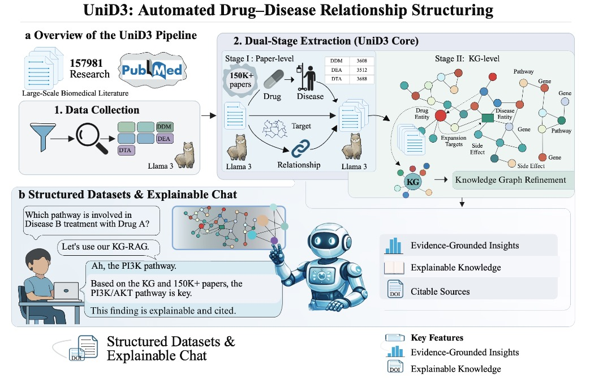

# $\text{Uni}D^3$: A Knowledge Graph-Enhanced Retrieval-Augmented Generation Framework for Drug–Disease Discovery and Reasoning


### Overview

Drug–disease knowledge underpins drug discovery, repurposing and precision medicine, but is locked away in millions of unstructured biomedical abstracts and is only partially captured by manually curated databases. We present **UniD3**, an application-oriented framework that operationalises recent advances in large language models (LLMs) and knowledge-graph retrieval-augmented generation (KG-RAG) to turn raw PubMed literature into structured biomedical resources at scale. **UniD3** couples *task-specific prompting* for three clinically motivated tasks—Drug–Disease Matching (**DDM**), Drug Effectiveness Assessment (**DEA**) and Drug–Target Analysis (**DTA**)—with a *dual-stage entity extraction* procedure that performs paper-level extraction first and then re-extracts over the consolidated graph to recover cross-chunk and cross-document evidence. Running the pipeline on 157,849 PubMed articles with Llama-3.3-70B yields six knowledge graphs and three open datasets (28,915 **DDM**, 15,042 **DEA** and >4,000 **DTA** question–answer pairs). External validation on CDR, DrugReviews, P3ps and MedicationQA, together with a benchmark of seven biomedical LLMs and three LightRAG-augmented variants, shows that the resulting datasets are faithful to curated biomedical sources and that retrieval over the **UniD3** graphs consistently improves downstream biomedical QA. We release all data, the constructed graphs and an explainable chatbot built on top, providing a reproducible, biomedical-application-driven recipe for KG-grounded LLM deployment in drug discovery and repurposing. The generated KGs and vector database are stored in [zenodo](https://zenodo.org/records/15368180). In addition, the UniD3 web [chatbot](https://unid3.site/) provides interactive access to the UniD3-generated datasets, enabling users to explore and query the resources.




### UniD3 QA （under [LightRAG](https://github.com/HKUDS/LightRAG) framework（required lightrag-hku==1.1.0））
   ```bash
   # Please download the generated knowledge graph from zenodo before using UniD3 QA. 
   # Please specify the specific working path, large language model and RAG mode.
   $ conda env create -f UniD3_environment.yaml
   # run ollama before here
   $ python QA_launcher.py --working_dir "/UniD3/KG_building_level2/level2_T2_70B" --model "myllama3.3_70B" --mode "mix"
   ```


### Dataset Usage  
   (1) [DDM](https://huggingface.co/datasets/Mike2481/UniD3_DDM)
   
   #### Pandas  
   ```
   import pandas as pd
   # Login using e.g. `huggingface-cli login` to access this dataset
   df = pd.read_csv("hf://datasets/Mike2481/UniD3_DDM/DDM.csv")
   ```
   #### HuggingFace 
   ```
   from datasets import load_dataset
   # Login using e.g. `huggingface-cli login` to access this dataset
   ds = load_dataset("Mike2481/UniD3_DDM")
   ```

   (2) [DEA](https://huggingface.co/datasets/Mike2481/UniD3_DEA)

   #### Pandas  
   ```
   import pandas as pd
   # Login using e.g. `huggingface-cli login` to access this dataset
   df = pd.read_csv("hf://datasets/Mike2481/UniD3_DEA/DEA.csv")
   ```
   #### HuggingFace 
   ```
   from datasets import load_dataset
   # Login using e.g. `huggingface-cli login` to access this dataset
   ds = load_dataset("Mike2481/UniD3_DEA")
   ```
   
   (3) [DTA](https://huggingface.co/datasets/Mike2481/UniD3_DTA)

   #### Pandas  
   ```
   import pandas as pd
   # Login using e.g. `huggingface-cli login` to access this dataset
   df = pd.read_csv("hf://datasets/Mike2481/UniD3_DTA/DTA.csv")
   ```
   #### HuggingFace 
   ```
   from datasets import load_dataset
   # Login using e.g. `huggingface-cli login` to access this dataset
   ds = load_dataset("Mike2481/UniD3_DTA")
   ```
### Citation

### License
MIT License © Qianqian Song Lab
